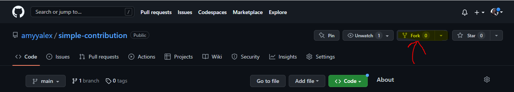
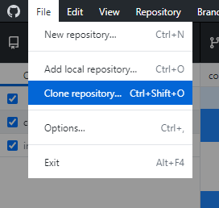
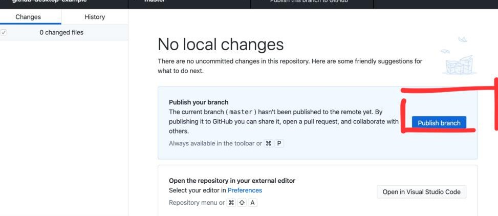
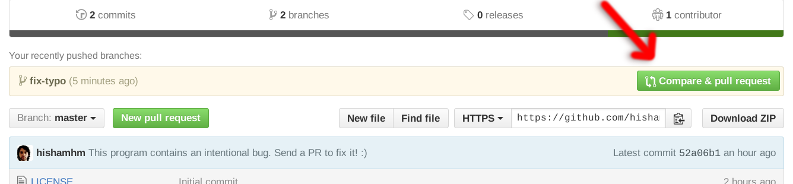
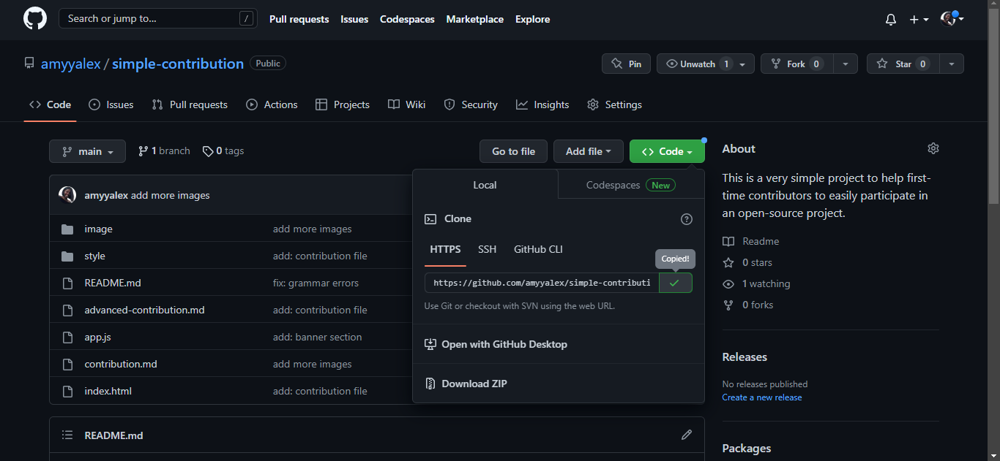
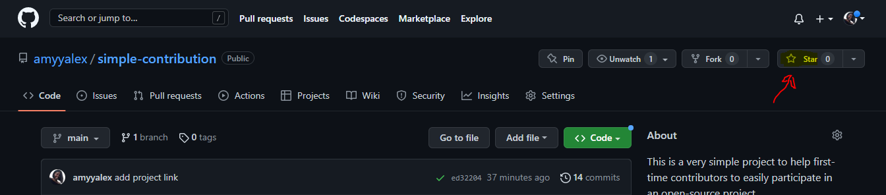

# Let's Setup!
Before we start contributing, First things first let's do a quick Github setup!

**First two things you'll want to do:**
1. Install git. Follow the instructions [here](https://git-scm.com/book/en/v2/Getting-Started-Installing-Git) to install git (if it's not already installed).
2. Create a free GitHub account or login to your GitHub account, If you already have one.

There are different ways to clone a repo; through GitHub Desktop, git bash (git terminal), VS Code terminal, and for this project, you have to have either one of the listed in other to successfully clone and contribute to this project.

1. Through GitHub Desktop, Download [GitHub Desktop app](https://desktop.github.com/).
2. Comfortable using Git on the command line and want to use the git terminal to clone, and download [git bash](https://desktop.gitbash.com/).
3. Alternatively If you use [VS Code](https://code.visualstudio.com/ "Visual Studio Code website") you can use the VS Code terminal to clone as well.

**Now that we are done with setting up the essentials needed for this contribution to be a success, let's get to the main thing, CONTRIBUTION!.<br><br>**

## Let the contribution begin!

**<span style="color:red;">Using GitHub Desktop.</span>**

<h4>Step 1: Fork this repository</h4>

- The objective here is to make a copy of this project and place it in your account. So go to the top right and click on the fork icon just as in the picture below.
  

<h4>Step 2: Clone the repository</h4>

- Now that you've successfully forked the repository and made a copy into our account, go ahead and clone the repository which is making a local copy of the project. This copy is saved on your machine.

**To clone:**

- Open the GitHub desktop app.

  - Click on _file_ and then _clone repository_

  

  - You will see a list of all your repositories and forks on GitHub.
  - Select `<your-github-username>/simple-contribution`.
  - Click _Clone_ button

* Now you have a local copy of the project.

<h4>Step 3: Create a new branch</h4>

- Once the repo has been cloned and you have it open in GitHub desktop it is time to create a new branch.
- We create a new branch to keep your changes separate from the master branch sometimes known as the main branch so that if things go wrong you can simply delete the branch and the main project is not affected.

* Click on _Current branch_

  - Then click on _New_
  - Give your branch a name
  - Click `Create branch`

  

  - Go ahead and name the branch whatever you want, to make it easier since you're to add your details, you can name it `your-name-information`.

  * Publish your new branch to GitHub

  - This branch you have created is separate from the master branch and it's the branch you'll be working with. Whatever you do, **make sure NOT to work on the master branch**

<h4>Step 4: Open the project with VS Code (or any editor of choice)</h4>

- Once you click on _open with visual studio code_, the project opens up for you VS Code open the index.html file to start editing.
- If you're using other editors, find the project folder on your computer. The `index.html` file is directly in the `simple-contribution` folder.

[Open VS Code](image/vscode-open.jpeg "Open index.html in your text editor")

<h4>Step 5: Copy and edit the cardDetails.json file</h4>


* Go to carddetail.json file,
  - You'll see an array of data, add a new object into the array (to make it easier, **copy** and **paste** carddetails object template and edit)
    The object template that you've copied is now **yours** for you to customize and edit.
  - Replace 'Your Name' with your name, 'Your Profession' with what you do, and add your favorite quote and the link to your socials.

- Once you're done, **save your changes** by pressing `ctrl + s`.
- Next is to **Test your changes**. THIS IS IMPORTANT! To do that, left-click on the index.html and navigate to
  _open in default browser_ and click on it. This project will open in your browser and you'll see what the changes you added look like on the site.
- Now, you have finished editing your code! And if nothing is broken and everything is working fine, you can go ahead and commit your changes.

<h4>Step 6: Commit and Push your changes</h4>

**Commit Changes**

- To commit your changes, go back to the GitHub desktop app; you will see that your changes have been added automatically to the staging area which means that all the changes made are already saved.
- Go ahead and _commit_ by filling in the _Summary_ field (the _description_ is optional). Add a short commit message explaining what you have changed e.g. add my information and click the _Commit to main_ button.
  **P.S: Please ensure that, before committing any changes, you've thoroughly checked for any broken code and ensured it's error-free on your side.**


**Push Changes**

- Now your changes are committed, the next thing to do is to _push_ your changes by clicking on the _Push_ button so as to get it in sync with your repository on GitHub. You are "pushing" the changes from your local repository to the remote repository on GitHub.



<h4>Step 7: Submit a PR(Pull Request)</h4>

- This is the last stage of your contribution; submitting a _Pull Request_ (PR).
- The reason for submitting a pull request is so that all the changes you made which is still on your own account of GitHub is sent to the main project to be merged.

* You can submit a pull request,

  - By either clicking on the _create pull request_ button that shows after clicking the push button in Github Desktop
  - Or you go to the main page of **your fork** on GitHub, towards the top of the repo you will see a highlighted pull request message with a green button that has _Compare and pull request_ written on it. Click on the button to create your pull request.

  * Now when the **Open a pull request** page opens, it should look like the one in the photo below. The original project is on the left, followed by the master branch. Your fork on the right and the branch you created

  

  - On the pull request page, write a title and add optional information in the description. Click the `Create pull request` button.

**NOTE: Please remember to include a comprehensive commit message and an extended description, particularly if your changes involve more than just adding your details. This will provide a clearer understanding of the nature and purpose of your commit within the project.**

**Your information can only be added once your pull request has been reviewed and merged only then would you be able to see you information on the live site!**

##### YAY, ALL DONE! GUESS WHO JUST CONTRIBUTED TO AN OPEN SOURCE PROJECT ON GITHUB...YOU!!!👏

**<span style="color:red;">Using git bash (git terminal).</span>**

These steps can also be used if you're using a VS Code terminal.

Go to the current directory where you want the cloned directory to be added.

```bash
cd <folder directory>
```

- Click on the clone button and then click the copy to clipboard icon.
  

Open the git bash terminal and run the following git command

```bash
git clone "repository url you just copied"
```

Change into the repository directory folder on your computer (the folder you just cloned):

```bash
cd simple-contribution
```

Now create a new branch using the `git checkout` command

```bash
git checkout -b your-new-branch-name
```

- To edit and changes, open project in VS Code

```bash
Code .
```

- After you've edit the template as in **step 5** above and made changes, tested and made sure the site is okay and nothing is broken
  Commit your changes

```bash
git add cardDetails.json
```

```bash
git commit -m "Add <your-name> card info"
```

```bash
git push origin -u your-branch-name
```

- Continue the process _using the github desktop_ steps (step7) after pushing as it's the same.

**Thank you for contributing to this project**.🤗

### Now that you're done contributing, go back to the main account repository, click on the site link by the right side, check out other contributor's socials, and connect with them. Also, click on the _star_ button beside the _fork_ button.



# Acknowledgements🙏

This project is heavily influenced by [Syknapse](https://github.com/Syknapse) Amazing [Contribute-To-This-Project](https://github.com/Syknapse/Contribute-To-This-Project) project with its fine-tuned tutorial. The project is also an awesome project for first-time contributors as well so go ahead and contribute!

- You can **follow me** and get in touch on [Twitter](https://twitter.com/AlexStephanie10 "@AlexStephanie10")

### HAPPY CONTRIBUTING!🎊
